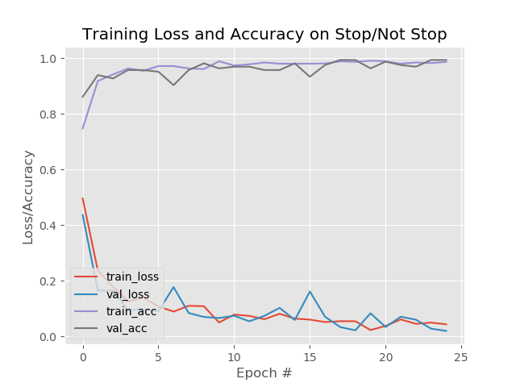
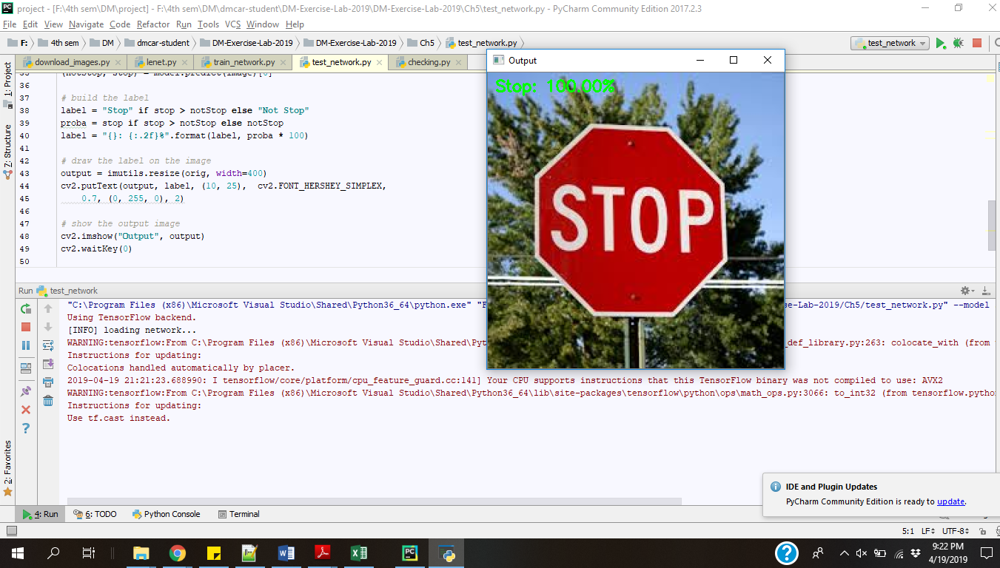

# Autonomous Vehicle using Data Mining Technique: Deep Learning
The main purpose of this project is to become familiar with data mining techniques, specifically Convolutional Neural Network (CNN), and to apply them to real world problems, i.e., autonomous vehicle.

## Pictures of assembly
1. [Image 1](https://drive.google.com/file/d/1zio-zZSUe7knNEc_1vDLkkJoXwUpKWCb/view?usp=sharing)
2. [Image 2](https://drive.google.com/file/d/1550nYlVT14LL0Rtm0M_JmsPTUqUID9Hq/view?usp=sharing)
3. [Image 3](https://drive.google.com/file/d/1pPpPxvRFj3pKGvzm1vC9qhmBHoVnO_hV/view?usp=sharing)
4. [Image 4](https://drive.google.com/file/d/1skFl2YTcwQNsQlwiV-hkdmHcafmH1l2S/view?usp=sharing)
5. [Image 5](https://drive.google.com/file/d/1z32HA7JAGrH3xo1Dp857yEf8v5j-cnf3/view?usp=sharing)
6. [Image 6](https://drive.google.com/file/d/19Fz13QAf4vYoh1POrcHUH6HJErmgr61L/view?usp=sharing)
7. [Image 7](https://drive.google.com/file/d/12g72JXNO6aQd358Y_J3rKQs9_eqBbEq1/view?usp=sharing)
8. [Image 8](https://drive.google.com/file/d/13V6S_NdE-RdXcaIsxUzwDeW_edxwPfy7/view?usp=sharing)
9. [Image 9](https://drive.google.com/file/d/1vQs1tR5Q8sMrAwXu0xWjEmmVJky7yxRS/view?usp=sharing)
10. [Image 10](https://drive.google.com/file/d/1_M3ELLRyr_1qFvQqxPjW6IH7-HlHDJ7w/view?usp=sharing)
11. [Image 11](https://drive.google.com/file/d/1w05DWWbVi4p982h5nxcR0EbbFaX3Y3PJ/view?usp=sharing)
12. [Image 12](https://drive.google.com/file/d/1NwSo4k0A5tSttkF9ISILtwUeA5Us6_UI/view?usp=sharing)

In this project, we are going to use Raspberry Pi 3 model B+ to control servos using 
Python. 

The car has the following functionalities:
1. Straight lane detection
2. Controlling back wheel servos
3. Controlling front wheel servos
4. Camera module
5. PID Control
6. Creating Video Clip

## Dataset Characteristics
- Image size: 28x28px 
- Number of images of stop sign: 299
- Number of images of speed sign: 365

## CNN Characteristics
- **Architecture**: LeNet Architecture
- **Optimizer**: Adam Optimizer  

The CNN has 1 input and 1 output layer, 2 convolutional layers.  
In the first set of convolutional layers, we have 20 filters and the size is 5*5. Each convolution layer has an activation function, ReLU which is followed by the pooling layers.  
  

Pool size is 2,2 and the stride is 2,2.  
The second set of convolutional layer is followed by another activation function, ReLU and a softmax function. It has 50 filters each of size 5*5.

The model can be optimized by evaluating it against test data and determining the __Loss__ and __Accuracy__.  
Upon evaluating the model and finding out the Loss and Accuracy, we have made the following observations:  

- **loss**: 0.0425
- **acc**: 0.9875
- **val_loss**: 0.0198
- **val_acc**: 0.9940

*As seen in graph below*

So, upon optimizing, we have determined the following values:
- **# of epoch** = 25
- **parameter values** = Convolutional layer 1- 25 filters of size 5x5, Convolutional layer 2 - 50 filters of 5x5
- **drop out** = 0.2
- **learning rate**: We used Adam optimizer with learning rate __le-3__. The learning rate decay over each update is __le-3/25__.

## Evaluating the Neural Network

## Stop Detection
Video of the car detecting and halting at a stop sign: [Link to Google Drive](https://drive.google.com/file/d/18YQs561FhR7xRYaCunriazyaRNLV-G4e/view?usp=sharing)

## Clips of car detecting various traffic signs
Clip 1: [Link to Google Drive](https://drive.google.com/open?id=1dA3tGCX0-bF6ztPXY2rY3rfj_6NxQpTo)
Clip 2: [Link to Google Drive](https://drive.google.com/open?id=1_2WRxWlovXNYGuZJvaSZHS0fMCwrsIh4)
Clip 3: [Link to Google Drive](https://drive.google.com/open?id=1n62VGi3BvuZShSR7JaLEwE7nIhZhUIMx)

## Suggestions to overcome limitations
1.  Train the car to calibrate the position of the car to the initial position from the beginning.
2.  Train the car to understand different types of images with the same meaning.
3.  The material with which the car has been assembled in very weak. A stronger material would be better while assembling the car.
4.  An option to manually control using joystick in addition to the automation, to overcome the exceptional situation proactively.
5.  Increase the memory of the card so that it can hold more data like bigger datasets, etc.
6.  More reliable power supply.
7.  Since running the pi tends to heat the motherboard, better air circulation maybe required.
8.  Lane detection can be improved by keeping the camera intact which can help analyze the road signs easily.
9.  A smaller dataset has been used considering the limitation of computing power or a lack of GPU, using more images for training would be better.
10. Using higher resolution images, would improve the performance of the model.
11. Using deeper network architecture during training would make the model efficient.

